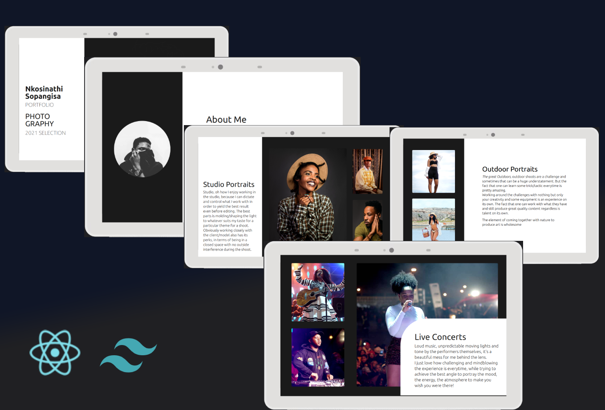

# PixelGen

A web application built with React, Vite, Tailwind, Redux Toolkit, Nodejs and MongoDb...



## Demo

You can check out a live demo of the application [here](https://pixelgen.vercel.app).


## Technologies

### Frontend
- **React:** A JavaScript library for building user interfaces.
- **Vite:** A build tool that focuses on fast development and server rendering.
- **Tailwind CSS:** A utility-first CSS framework for building custom designs quickly.

## Project Structure

The project is organized to ensure a clean and efficient development process. Key features include:

- **Client:** Frontend built with React, Vite, and Tailwind CSS.

## Getting started

1. Clone the repository:

```~~bash~~
git clone https://github.com/Yonela-Johannes/pixelgen

```

2. Install the dependencies:
  ```bash
    cd pixelgen
    npm install
  ```

3. Start the development server:
npm run dev

## Available commands

Running commands with npm `npm run [command]`

| command         | description                              |
| :-------------- | :--------------------------------------- |
| `dev`           | Starts a development instance of the app |

4. Open the application in your browser at http://localhost:3000.

## Contributing

If you would like to contribute to this project, please fork the repository and create a pull request.

## License

This project is licensed under the [MIT License](LICENSE).
